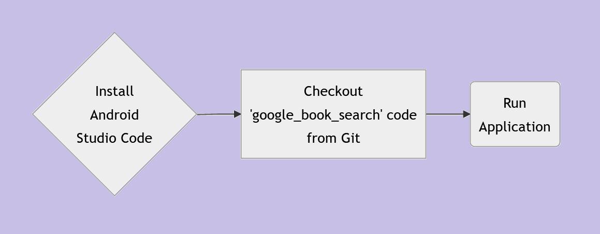
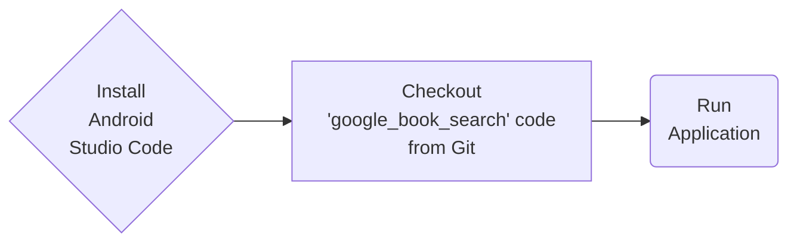

# Google Book Search:  Search for any books using Google Books API via Web View
Google Book Search shows how to create a simple Android Application based on Web View in Kotlin.

### Workflow

### References
<ul>
 <li><a href="https://developer.android.com/studio">Android Studio</a></li>
</ul>

### Tutorial

